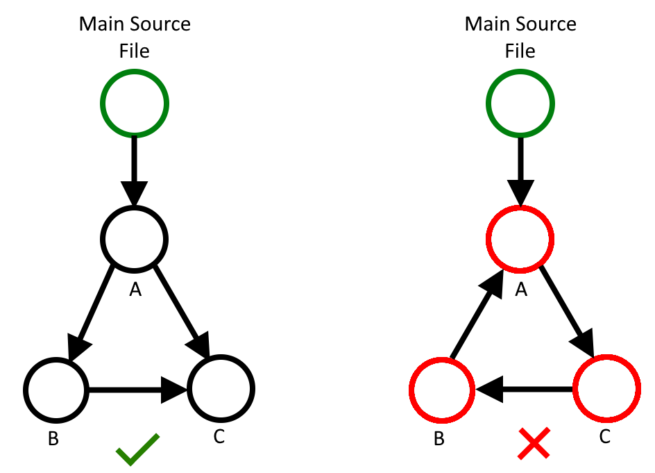

**Compilation Process**
=======================

Phases
------
Compilation is split into three phases - Parsing, Processing, and Integrating.
This section will guide the reader though the steps that taken in each phase.

Parsing
-------
*Objective: Translate text from a .mkpk file into an intermediate
representation.*

Step 1: Heading Detection
^^^^^^^^^^^^^^^^^^^^^^^^^
In the first step, a simple iteration of the file is performed where headings,
defined using [[heading]] are detected, and stored as a state which determines
where to put the lines underneath the heading. As a result, there will be an
optional set of lines for each - metadata, data, code, gadgets.

Step 2: Parse Functions
^^^^^^^^^^^^^^^^^^^^^^^
Code lines collected under the functions heading are parsed into
MKPKFunction objects. This stores the name of the function, its arguments, and
the code lines beneath it. The following is the class definition of
MKPKFunction:

.. code-block:: python

    class MKPKFunction:
    """A data strcture to encapsulate code functions used in makka pakka."""

    def __init__(self, name: str, arguments: List[str], content: List[str]):
        """
        Code structure constructor.

        :param name: A unique function name for the section of code.
        :param arugments: A list of unique names for arguements that this function
            expects.
        :param content: A list of lines of makka pakka code.
        """
        self.name = name
        self.is_main = name == "main"
        self.num_arguments = len(arguments)
        self.arguments = arguments
        self.content = content

Step 3: Parse Data
^^^^^^^^^^^^^^^^^^
Data definitions collected under the data heading are parsed into MKPKData
objects. This contains the name of the data label, its value, and its
interpretted data type - the following is the class definition of MKPKDataType
and MKPKData:

.. code-block:: python

    class MKPKDataType:
        """
        Identifies the data type of a MKPKData object.
        """

        NONE = 0
        STR = 1
        INT = 2

    class MKPKData:
        """A data structure to encapsulate constant data used in makka pakka"""

        def __init__(self, name: str, value: Union[int, str], type: MKPKDataType):
            """
            Data structure constructor.

            :param name: A unique label assigned to the constant data.
            :param value: The constant data itself.
            :param type: The data type of the constant data.
            """
            self.name = name
            self.value = value
            self.type = type

Step 4: Parse Gadgets
^^^^^^^^^^^^^^^^^^^^^
Gadget definitions collected under the gadget heading are parsed into
MKPKGadget objects. This contains the virtual memory address of the gadget,
and instructions before a 'ret' at that address. The following is the class
definition of MKPKGadget:

.. code-block:: python

    class MKPKGadget:
        """A data structure to encapsulate ROP gadgets used in makka pakka."""

        def __init__(self, memory_location: str, content: List[str]) -> None:
            """
            Gadget Constructor.

            :param memory_location: The virtual memory address of the ROP gadget in the
                target binary.
            :param content: A list of assembly lines at that address, up until a ret is
                reached.
            """
            self.memory_location = memory_location
            self.content = content

Step 5: Parse Metadata
^^^^^^^^^^^^^^^^^^^^^^
Metadata is considered all lines in the source file that are no defined under
a heading - i.e. at the top of a file. Metadata is parsed into MKPKMetaData
objects, which has the following definition.

.. code-block:: python

    class MKPKMetaData:
        """A data structure to encapsulate metadata used in makka pakka"""

        def __init__(self, label: str, value: str) -> None:
            """
            Metadata Constructor.

            :param label: The label to uniquely identify the meta data.
            :param values: The values associated with the metadata label.
            """
            self.label: str = label
            self.values: List[str] = []

Step 6: Collate Structures
^^^^^^^^^^^^^^^^^^^^^^^^^^
The objects from step 2-5 are then collected into a single object - MKPKIR.
This is the complete intermediate representation of the makka pakka programming
language. The following is the class definition:

.. code-block:: python

    class MKPKIR:
        """An intermediate representation of the makka pakka programming language
        to be populated during the parsing phase."""

        def __init__(self):
            self.data: List[MKPKData] = []
            self.functions: List[MKPKFunction] = []
            self.gadgets: List[MKPKGadget] = []
            self.metadata: List[MKPKMetaData] = []

.. note::
    All data structures used to compile makka pakka can be found in
    :doc:`data_structures`.

Linking
-------
*Objective: Resolve reference to external files, and parse their contents.*

Step 1: Discover Dependencies
^^^^^^^^^^^^^^^^^^^^^^^^^^^^^
Linking starts with metadata labels. Files that link with other files use the
'!link {mkpk_filename}' directive. Therefore, the first step is to extract the
filenames that the current file expects to link with.

Step 2: Resolve Dependencies
^^^^^^^^^^^^^^^^^^^^^^^^^^^^
Makka pakka then attempts to find the files that are specified for linking.
This is done by searching in the directories defined in
makka_pakka.linking.linker_path (shown below). The directory of the main source
file is added to the default linker paths at runtime with the highest priority.
The linking priority logic is abstracted by the PriorityList implementation in
makka_pakka.linking.priority_list. If a linked file is not found during this
process, then a MKPKLinkingError will be raised.

.. code-block:: python

    # The default directories to look for linkable .mkpk files in.
    DEFAULT_LINKER_PATHS: List[str] = [
        "/usr/local/lib/mkpk/",
        str(Path.home()) + "/.local/lib/mkpk/",
        str(Path(__file__).parent.parent.parent / "lib/"),
    ]

Step 3: Parse Dependencies
^^^^^^^^^^^^^^^^^^^^^^^^^^
Once the dependency is found, the process starts again -
i.e. the file is parsed into a MKPKIR, then, if this file also contains link
directives, these will be resolved.

To avoid cyclic dependencies causing an infinite linking loop, a custom
DirectedGraph structure is used, implemented in
makka_pakka.directed_graph.directed_graph. The diagram below illustrates an
acceptable, and an unacceptable dependency graph. In the unacceptable case, a
MKPKCyclicDependency error will be raised.

Step 4: Merge IR Symbols
^^^^^^^^^^^^^^^^^^^^^^^^
The overall goal of the parsing phase is to create a single MKPKIR object that
can be used as an input into the processing phase. When linking is performed,
makka pakka ends up with multiple MKPKIR objects which can contain conflicting
symbols (function names etc.). To resolve this issue, all MKPKIR objects are
merged into the main object (the one created as a result of parsing the main
source file.). If there is a conflict in symbols, then a MKPKLinkingError will
be raised.

.. note::
    In the future, namespacing may be implemented to prevent common conflicts.
    For now, libraries implement their data labels and function name in full
    uppercase. This means user programs are safe to use the entire lowercase
    namespace.

Processing
----------
*Objective: Resolve references to data labels and functions.*

Step 1: Data Replacement
^^^^^^^^^^^^^^^^^^^^^^^^
Find all instances of '${<name>}' references used in the code section of the
MKPKIR object. Attempt to find these references in the data section of the
MKPKIR object. If it exists as integer data, then the reference is directly
replaced with the integer value. If it is string data, then the reference is
replaced with a relative address of the data definition. If data is referenced
that doesn't exist in the MKPKIR data section, then this issue is ignored for
now, as the data may be an arguement in the function. This is handled in
step 2.

Step 2: Function Replacement
^^^^^^^^^^^^^^^^^^^^^^^^^^^^
Function replacement is implemented as a single pass over the 'main' function.
When a function call is found in the main function, the function call is
replaced with the code found in the MKPKIR object for that function. This is a
recursive process, the called function may itself call another function - Makka
pakka will recursively resolve these function call unless a cyclic function
call loop is detected, using the same DirectedGraph approach as with linking.
If a function is called which doesn't exist in the MKPKIR, then a
MKPKProcessingError will be raised.

When a function is called with arguments, these arguments are pushed into a
MKPKArgumentSet structure which encapsulates them. As recursive function calls
are made, the MKPKArgumentSet objects are pushed onto a stack, the top of the
stack being the set of arguments to the current function. Any remaining data
references within the function are assumed to be arguments - these are then
replaced using the corresponding value in the MKPKArgumentSet. If the data
reference is not an argument in the function, then it cannot be resolved, and
makka pakka will raise a MKPKProcessingError.

Integrating
-----------
*Objective: Replace suitable instruction sequences with ROP calls, and write
the program to file.*

Step 1: ROP Gadget Replacement
^^^^^^^^^^^^^^^^^^^^^^^^^^^^^^
| *(Currently unimplemented)*

The resulting code from the processing phase is passed through a multi-line
'find-and-replace' style operation where instruction sequences ,for which
gadgets have been defined under a [[gadget]] heading, are replaced with a
relative call to an offset which performs a semantically equivalent operation.

Step 2: Assembly Formatting
^^^^^^^^^^^^^^^^^^^^^^^^^^^
Lastly, some formatting needs to be done to make the assembly code compatible
as a standalone program. Firstly the code must be defined under a _start
function. The data is also translated in assembly data definitions and inserted
at the bottom of the file.

Step 3: Write To File
^^^^^^^^^^^^^^^^^^^^^
The result is written to the specfied output file location.

.. seealso::
    - :doc:`language_spec`
    - :doc:`examples`
